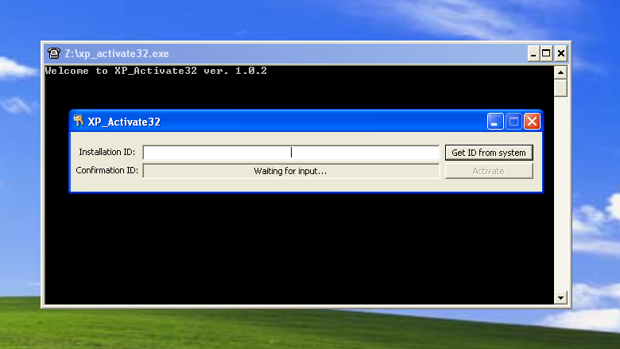

# xp_activate32 



Mini C++ program for activating Windows XP.

## Installation & Usage 
Self contained, static .exe, simply run and press

## Building

### MSVS
 - This is the only way to reliably get binaries that work on XP, however, MinGW can also be used.
 Make sure you have Visual Studio 2010 - 2022 installed. Install the [v141_xp toolset](https://learn.microsoft.com/en-us/cpp/build/configuring-programs-for-windows-xp)
if using MSVS 2017/2019/2022. In an MSVS terminal with `msbuild` in your path, invoke:

(Debug)
```cmd
  msbuild.exe /p:Configuration=Debug /p:Platform=x86 xp_activate32.sln
```

(Release)
```cmd
  msbuild.exe -p:Configuration=Release /p:Platform=x86 xp_activate32.sln
```

 - Replace `/p:Platform=x86`with `/p:Platform=x64` to make a 64 bit build suitable for Windows XP x64.

### MinGW

From an MinGW prompt (you may have to edit the `CC`/ `CXX`/ `LD`/ `RC` variables in the [Makefile](./Makefile)):

```bash
  make clean && make all
```

## About
 Based on Endermanch's work https://github.com/Endermanch/XPConfirmationIDKeygen, which is itself based on other's
work. Please see the original [XPConfirmationIDKeygen README](./orig/ORIGINAL_README.md) for more information.
